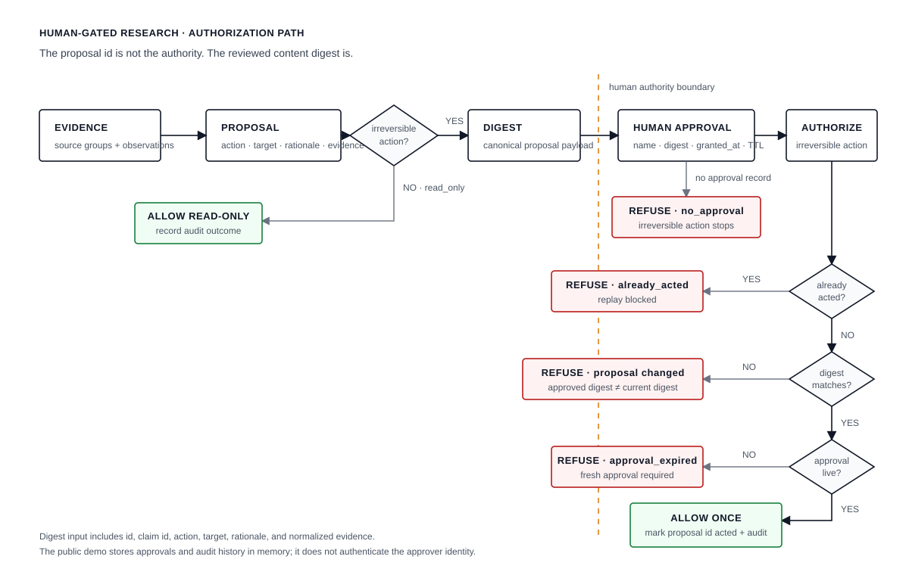

# Human-Gated Research

**Research can be automatic. Sending, submitting, or spending still gets a human checkpoint.**

This repo isolates a pattern I use in agent systems:

**evidence → claims → proposal → human approval → exact digest check → authorize once**

## What makes the approval meaningful

The approval is bound to the **content**, not just a proposal id.

If the target or rationale changes after approval, the digest changes and the action is refused.

That sounds small. It is the difference between approving a plan and approving a filename.

## Repo map

| Area | Responsibility |
|---|---|
| `models.py` | evidence, claims, action kinds, outcomes |
| `evidence.py` | rank by independent corroboration |
| `digest.py` | canonical serialization + content hash |
| `proposal.py` | stable proposal payload |
| `gate.py` | approval TTL, replay protection, audit |
| `tests/` | evidence, digest, read-only, approval behavior |
| `docs/` | design reasoning |

Read-only work stays cheap. Irreversible actions pay the governance cost.

## Why not rank by confidence?

Because model confidence is the model grading its own homework.

Independent sources are at least inspectable.

The private systems that inspired this repo add discovery, browser tooling, and operator workflows. This public slice keeps the trust boundary visible.

Want to audit the authority boundary? Read the [invariants](docs/invariants.md), [failure modes](docs/failure-modes.md), [design decisions](docs/decisions.md), and [provenance](PROVENANCE.md).

> The human approves the plan, not whatever the plan mutates into later.

## Inspect deeper

- [Design overview](docs/overview.md)
- [Why the design looks this way](docs/decisions.md)
- [How it fails on purpose](docs/failure-modes.md)
- [Security / privacy boundary](SECURITY.md)

The README is the front door. The interesting arguments are in those files.
