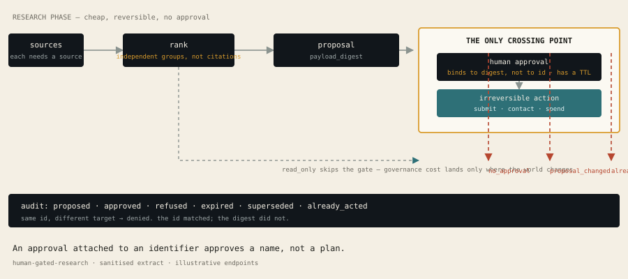

# human-gated-research

**Evidence-ranked research proposals where every irreversible action needs a digest-matched human approval.**

An agent that gathers information and an agent that acts on the world are
different capabilities with different risk profiles. This module separates them
explicitly:

```
gather ──▶ rank ──▶ propose  ‖  human decides  ‖  act
                              ↑
                   the only crossing point
```



```bash
pip install pytest
python -m pytest                             # 14 tests
PYTHONPATH=src python -m research_gate.demo  # the walkthrough below, live
```

No dependencies. No network. Python 3.10+.

---

## Why this exists

The pattern "AI does research and then does something about it" is where agent
systems produce incidents. The research phase looks harmless. The action phase
emails a stranger, submits a form, or spends money.

Most attempts to control this gate on **what the action is**. That is the wrong
level: the same action type is fine for one target and catastrophic for another.
A mail merge is harmless until you change the recipient list.

This gates on **whether the exact content was approved**, not on whether the
action looks reasonable.

## What it does

| Piece | Guarantee |
|---|---|
| `Evidence` | Cannot be constructed without a source. A claim with no source is an opinion. |
| `Claim.independent_source_count` | Counts distinct source *groups*. Five citations from one wire story are one source. |
| `rank_claims` | Ranks by corroboration, then recency. Never by model confidence. |
| `Proposal.payload_digest` | Content hash, stable across evidence ordering. |
| `ActionGate.authorize` | The only path to an irreversible effect. No override flag exists. |

## The walkthrough

```
1. Corroboration counts sources, not citations
  c2  2 independent sources  corroborated
  c3  1 independent sources  single source
  c1  1 independent sources  single source

2. Approval binds to content, not to an id
  same id, different target          DENY    proposal_changed_after_approval
                                      the id matched; the digest did not

3. Every irreversible action needs a live approval
  never approved                     DENY    no_approval
  approved, acted once               ALLOW   approved
  same approval replayed             DENY    already_acted

4. Approvals expire
  approved 60 minutes ago, ttl 60s   DENY    approval_expired
```

## Three things worth reading the code for

**1. Approval binds to the digest, not the identifier.**

```python
if approval.payload_digest != proposal.payload_digest:
    return False, "proposal_changed_after_approval"
```

The approval in the walkthrough is on a proposal with the exact same `id` as
the one that got refused — and it is refused anyway, because the content moved.
Gating on the id alone would let an approved plan be repointed at a different
target, which is the actual attack.

**2. Evidence order does not affect the digest.**

```python
ordered = sorted(self.evidence, key=lambda e: (e.independent_group, e.source, e.observed_at))
```

Two reviewers who read the same sources in a different order must produce the
same digest. Without this, approval binding breaks for reasons unrelated to
content — and a governance control that produces false failures gets switched off.

*(This one was a real bug. The tests caught it before it shipped.)*

**3. Read-only stays cheap.**

```python
IRREVERSIBLE_ACTIONS = frozenset({SUBMIT_PUBLIC, CONTACT_THIRD_PARTY, SPEND_MONEY})
```

Governance overhead is applied only where the world actually changes. Making a
reviewer approve every search would train them to approve without reading, which
is worse than having no gate at all.

**Why not rank by confidence?** Because confidence is the model reporting on its
own reliability, which no caller can audit. A citation can be followed.

## Limitations

- **`Evidence` requires a source string; it does not verify one.** A plausible
  URL proves nothing. Real verification is a separate, larger problem.
- **Approval is trusted.** The gate checks that a *name* was recorded, not that
  the person had authority. Identity is out of scope.
- **In-memory.** `ActionGate` state does not survive a restart, so a crash
  between approve and act loses the approval — which is the safe direction.
- **`read_only` is a label.** Nothing here enforces that an action marked
  `READ_ONLY` really is. A mislabelled action inherits `READ_ONLY`'s freedom.
  **This is the weakest part of the design** and the reason the irreversible set
  should be derived from capability rather than declared by the caller.
- **No concurrency control.** Two callers can both pass `authorize` for the same
  proposal in the same instant on different threads.

## Provenance

A sanitised extract from a private research-operations system. Vendor names,
endpoints and infrastructure are removed. The digest binding, the independent
source counting, the expiry rules and the audit trail are the real
implementation.

The full system is not public.

## If you take one thing

An approval that attaches to an identifier approves a *name*, not a *plan*.
Hash what the human actually read.
