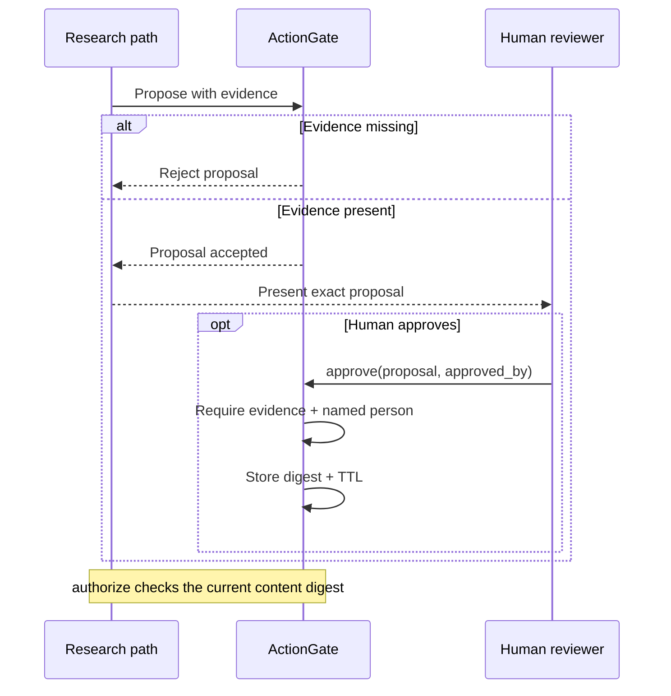
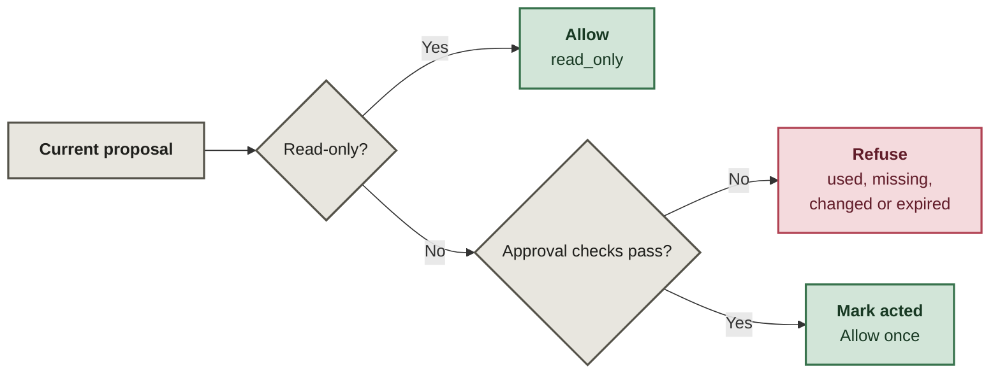

# Human-Gated Research

Evidence-backed research with approval tied to the exact proposal a person reviewed. Read-only work can proceed; consequential actions require a current, matching, unused approval.

**A proposal id is not a reusable permission coupon.**

This public sample comes from my private research and acquisition tooling. It makes evidence ranking and approval semantics reviewable; I can build and adapt the surrounding research applications, review workflows, and connectors for different requirements.

## Review: approve the content, not just the id

## Authorization: check again at the action boundary

`submit_public`, `contact_third_party`, and `spend_money` take the approval path below. The caller owns the external action after the gate returns.

## The trust boundary

`Proposal.payload_digest` hashes a canonical JSON payload containing the proposal id, claim id, action, target, rationale, and normalized evidence. Changing any of that content invalidates the approval, even if the proposal id stays the same.

Authorization checks the current state in this order:

| Check | Result |
|---|---|
| Action is read-only | allow immediately and record `read_only`; no human approval required |
| Proposal id already acted | refuse with `already_acted` |
| No approval exists | refuse with `no_approval` |
| Approved digest differs from current digest | refuse with `proposal_changed_after_approval` |
| Approval is older than its TTL | refuse with `approval_expired` |
| All irreversible-action checks pass | mark the proposal id acted, record approval, allow once |

Approval requires a non-empty `approved_by` name; identity authentication is outside this sample.

## Evidence before action

`rank_claims()` prefers the number of **independent source groups** and uses newest evidence only as a tie-breaker. Multiple citations assigned to the same independent group count once.

`ActionGate.propose()` rejects a proposal with no evidence, and `ActionGate.approve()` reuses that same check. Skipping the explicit `propose()` call therefore cannot create an approval for an evidence-free irreversible proposal.

Evidence grouping is part of the digest; changing it invalidates approval too.

## Where to inspect

- [`src/research_gate/proposal.py`](src/research_gate/proposal.py) — approval-relevant proposal payload.
- [`src/research_gate/digest.py`](src/research_gate/digest.py) — canonical JSON and SHA-256 digest.
- [`src/research_gate/gate.py`](src/research_gate/gate.py) — evidence requirement, approval TTL, refusal paths, replay prevention, and audit history.
- [`src/research_gate/evidence.py`](src/research_gate/evidence.py) — independent-corroboration ranking.
- [`src/research_gate/demo.py`](src/research_gate/demo.py) — runnable walkthrough of mutation, missing approval, replay, expiry, and read-only behavior.

Tests cover evidence-free approval rejection, the read-only bypass, missing approval, mutation after approval, expiry, replay refusal, one-time allowance, and the named-approver requirement.

Verification commands and expected checks: [`docs/verification.md`](docs/verification.md).

## What approval does not prove

This repository demonstrates approval semantics, not a production authorization service. Approvals, acted ids, and audit history are in-memory; the approver name is not authenticated; and the repo contains no browser credentials, payment method, email account, or external-action transport.

See [`SECURITY.md`](SECURITY.md) for production-boundary requirements and [`PROVENANCE.md`](PROVENANCE.md) for what was preserved or removed from the private systems that inspired this public slice.
